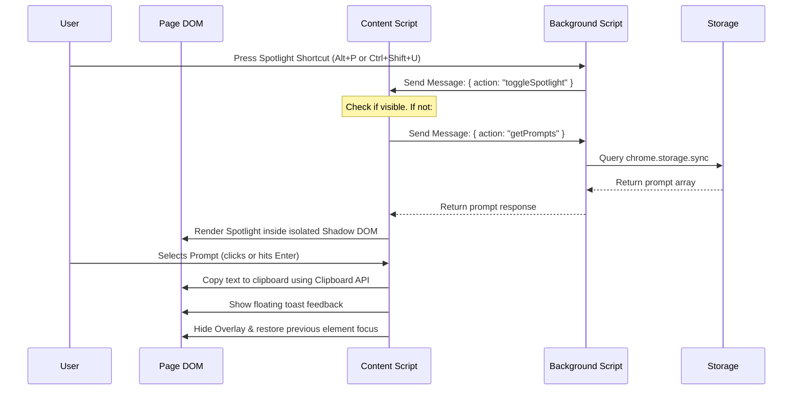

# Architecture Documentation

This document explains the messaging workflow, encapsulation model, storage design, and runtime architecture of Souffleur. It is designed to serve as a guide for developers and AI agents maintaining the extension.

---

## 🛰️ Communication Architecture

Souffleur consists of three primary components:
1.  **Background Script** (Service Worker in Chrome, non-persistent script in Firefox): Listens for commands and toolbar button clicks, and routes messages.
2.  **Content Script**: Injects the Spotlight overlay UI into active webpages and manages user search inputs.
3.  **Sidebar Script**: Lives inside the side-panel (Chrome) or sidebar (Firefox) and allows users to manage their prompt library.

These components coordinate using `chrome.runtime.sendMessage` and `chrome.tabs.sendMessage`.

### Sequence Diagram: Toggling the Spotlight Overlay



---

## ✉️ Message API Definition

The following messages are used to communicate between scripts:

### 1. `getPrompts`
*   **Sender**: Content Script (`src/content.js`)
*   **Recipient**: Background Script (`src/background.js`)
*   **Payload**: `{ action: "getPrompts" }`
*   **Response**:
    *   Success: `{ prompts: [{ id, title, text }, ...] }`
    *   Error: `{ prompts: [], error: string }`

### 2. `toggleSpotlight`
*   **Sender**: Background Script (`src/background.js`)
*   **Recipient**: Content Script (`src/content.js`)
*   **Payload**: `{ action: "toggleSpotlight" }`
*   **Response**: `void`

---

## 🗄️ Storage Strategy (`chrome.storage.sync`)

Souffleur uses **`chrome.storage.sync`** to persist the prompt list. This automatically synchronizes a user's prompt library across all their signed-in browser instances (e.g. Chrome accounts or Firefox profiles).

### Important API Limits
Because `chrome.storage.sync` syncs data over Google/Mozilla servers, it enforces strict quotas that developers must keep in mind:
*   **QUOTA_BYTES**: Total data storage is limited to **102,400 bytes (102KB)**.
*   **QUOTA_BYTES_PER_ITEM**: Single items cannot exceed **8,192 bytes (8KB)**. Since the entire prompt list is stored under a single key (`"prompts"`), the entire prompt collection must fit within the 102KB quota.
*   **MAX_WRITE_OPERATIONS_PER_HOUR**: A maximum of **1,800 write operations** can be executed per hour. This is generally not a bottleneck for manual configuration adjustments, but automated scripts or bulk drag-and-drop operations must throttle storage writes.

---

## 🛡️ Style Isolation (Shadow DOM)

To prevent host webpages from altering the Spotlight UI layout, the overlay is injected using **Shadow DOM encapsulation**:

1.  A top-level wrapper `<div id="souffleur-spotlight-root">` is appended to the webpage `document.body`.
2.  An isolated shadow root is attached to this wrapper:
    ```javascript
    const shadowRoot = host.attachShadow({ mode: "open" });
    ```
3.  The extension's stylesheet `<style>` is appended directly *inside* this shadow root, alongside the spotlight DOM element `<div class="souffleur-spotlight">`.
4.  **Benefits**:
    *   **Immune to Page Resets**: Global page resets (e.g. `* { margin: 0; }` or custom body margins) are not applied inside the shadow root boundary.
    *   **No Class Clashes**: The webpage's own CSS selectors cannot target selectors inside the shadow root.
    *   **No Style Leakage**: Souffleur's styling rules are confined inside the shadow root and cannot leak out to affect the host webpage.

---

## 🌐 Platform Detection & Routing

The unified `background.js` handles platform routing dynamically at runtime by checking API definitions:

```javascript
const isFirefox = typeof browser !== 'undefined' && typeof browser.sidebarAction !== 'undefined';
```

*   **Firefox Routing**: Toggles the sidebar panel using the Gecko-native `browser.sidebarAction.toggle()`. It also registers a `browser.action.onClicked` listener to intercept extension toolbar clicks.
*   **Chrome Routing**: Opens the side-panel using the Chromium-native `chrome.sidePanel.open()`. It configures Chrome to open the panel on action toolbar clicks by running `chrome.sidePanel.setPanelBehavior({ openPanelOnActionClick: true })`.
